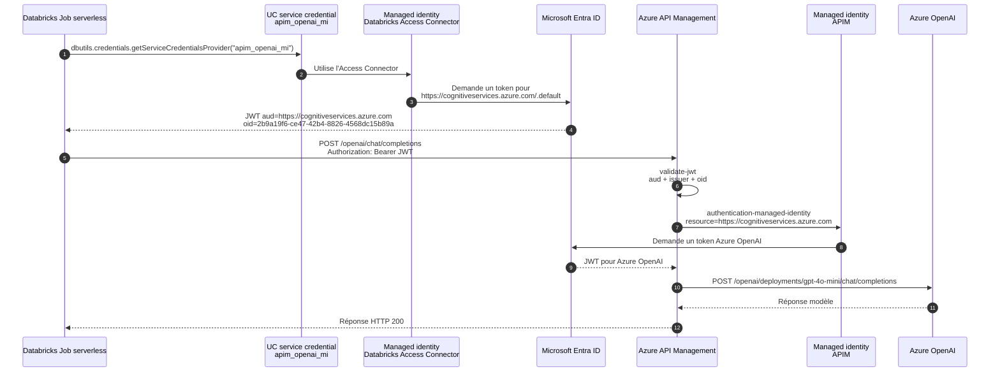

# POC Databricks -> APIM -> Azure OpenAI avec managed identity

Cette POC valide un appel Azure OpenAI via APIM, déclenché depuis un Job Databricks et authentifié sans secret applicatif.

Flux testé :

1. Un notebook Databricks utilise une Unity Catalog `SERVICE` credential adossée à un Databricks Access Connector.
2. Cette service credential émet un token Entra pour l'audience `https://cognitiveservices.azure.com`.
3. APIM valide le JWT entrant avec `validate-jwt`.
4. APIM autorise uniquement l'`oid` de la managed identity de l'Access Connector Databricks.
5. APIM appelle Azure OpenAI avec sa propre managed identity.

## Schéma du flux testé



## Ressources déployées

- Resource group : `rg-dbxapimpoc-60ld4e`
- Databricks workspace : `dbxapimpoc-60ld4e-dbx`
- Databricks workspace URL : `adb-7405610989278804.4.azuredatabricks.net`
- Databricks Access Connector : `dbxapimpoc-60ld4e-ac`
- Managed identity de l'Access Connector : `2b9a19f6-ce47-42b4-8826-4568dc15b89a`
- Service credential Unity Catalog : `apim_openai_mi`
- Azure OpenAI account : `dbxapimpoc60ld4eaoai`
- Azure OpenAI endpoint : `https://dbxapimpocaoai60ld4e.openai.azure.com/`
- Azure OpenAI deployment : `gpt-4o-mini`, pointant vers le modèle `gpt-4.1-mini` version `2025-04-14`
- APIM : `dbxapimpoc60ld4eapim`
- APIM gateway : `https://dbxapimpoc60ld4eapim.azure-api.net`
- APIM endpoint : `https://dbxapimpoc60ld4eapim.azure-api.net/openai/chat/completions`
- Audience JWT acceptée par APIM : `https://cognitiveservices.azure.com`
- Issuer JWT accepté par APIM : `https://sts.windows.net/495929eb-f078-464d-b6ef-e9fe18c31e12/`
- Claim d'autorisation APIM : `oid == 2b9a19f6-ce47-42b4-8826-4568dc15b89a`
- Databricks Job : `poc-apim-openai-managed-identity-test`
- Notebook importé : `/Users/marc.milbled@gmail.com/test_apim_managed_identity`

## Détail de l'implémentation

Terraform déploie l'infrastructure Azure :

- `azurerm_resource_group` pour isoler la POC.
- `azurerm_databricks_workspace` en SKU `premium`.
- `azurerm_databricks_access_connector` avec identité managée système.
- `azurerm_cognitive_account` de type `OpenAI`, avec `local_auth_enabled=false` pour éviter l'usage de clés.
- `azurerm_api_management` en SKU `Consumption_0`, avec identité managée système.
- `azurerm_role_assignment` donnant à l'identité managée APIM le rôle `Cognitive Services OpenAI User` sur le compte Azure OpenAI.
- `azurerm_api_management_api`, `azurerm_api_management_api_operation` et `azurerm_api_management_api_policy` pour exposer `/openai/chat/completions`.
- `azuread_application`, `azuread_service_principal` et `azuread_app_role_assignment` restent présents dans le code, mais le test final n'utilise pas l'audience `api://...` car elle n'est pas compatible avec le provider de service credential Databricks.

La policy APIM fait deux validations distinctes :

- Entrant Databricks vers APIM : `validate-jwt` vérifie l'audience, l'issuer et l'`oid` de la managed identity Databricks.
- Sortant APIM vers Azure OpenAI : `authentication-managed-identity` obtient un token pour `https://cognitiveservices.azure.com` avec l'identité managée d'APIM.

Le script `deploy-databricks-mi-pipeline.sh` déploie la partie Databricks non couverte par Terraform :

- Création idempotente de la Unity Catalog service credential `apim_openai_mi` avec `purpose=SERVICE`.
- Association de cette credential à l'Access Connector Terraform.
- Import d'un notebook Python de test.
- Création ou mise à jour d'un Job Databricks.
- Lancement du Job et récupération de la sortie du run.

## Serverless et egress réseau

Le test a été exécuté depuis un Job Databricks utilisant du compute serverless. Le workspace Azure Databricks lui-même reste un workspace Azure Databricks classique ; c'est le compute du Job qui est serverless.

Point important pour un contexte avec Conditional Access :

- Le token Entra est demandé depuis le runtime Databricks serverless via `dbutils.credentials.getServiceCredentialsProvider("apim_openai_mi")`.
- L'appel au token endpoint Entra ID ne sort pas depuis un VNet ou un NAT Gateway déployé dans ce projet.
- Le trafic réseau sortant du compute serverless passe par le compute plane managé Databricks/Microsoft.
- Ce n'est pas "natté dans le tenant" simplement parce que les ressources sont dans le même tenant Entra.
- Si des Conditional Access policies évaluent la localisation réseau, les IP vues par Entra ID peuvent donc être celles du plan serverless Databricks/Microsoft, pas une IP publique contrôlée par le tenant client.

La POC valide donc correctement l'usage de la managed identity depuis Databricks serverless, mais elle ne valide pas un scénario avec egress IP client fixe. Pour rendre le test encore plus proche d'un environnement avec restrictions réseau, il faut ajouter une configuration Databricks de contrôle d'egress serverless, par exemple une Network Connectivity Configuration / network policy si disponible dans l'environnement cible, ou utiliser du compute Databricks classique avec VNet injection et NAT Gateway.

## Fichiers

- [terraform/main.tf](/home/marc/poc-databricks-apim-openai/terraform/main.tf)
- [terraform/outputs.tf](/home/marc/poc-databricks-apim-openai/terraform/outputs.tf)
- [terraform/variables.tf](/home/marc/poc-databricks-apim-openai/terraform/variables.tf)
- [scripts/deploy-openai-model.sh](/home/marc/poc-databricks-apim-openai/scripts/deploy-openai-model.sh)
- [scripts/deploy-databricks-mi-pipeline.sh](/home/marc/poc-databricks-apim-openai/scripts/deploy-databricks-mi-pipeline.sh)

## Déploiement infra

```bash
cd /home/marc/poc-databricks-apim-openai/terraform
terraform init
terraform plan -out=tfplan
terraform apply tfplan
```

Ce déploiement a été exécuté avec succès : `14 added, 0 changed, 0 destroyed`.

Une mise à jour complémentaire de policy APIM a ensuite été appliquée : `0 added, 1 changed, 0 destroyed`.

## Déploiement du modèle

```bash
cd /home/marc/poc-databricks-apim-openai
./scripts/deploy-openai-model.sh
```

Le modèle initial `gpt-4o-mini` version `2024-07-18` est refusé par Azure car il est déprécié depuis le 31 mars 2026. Le script déploie donc par défaut le modèle de remplacement `gpt-4.1-mini` version `2025-04-14`, tout en conservant le nom de déploiement `gpt-4o-mini` attendu par la policy APIM.

## Pipeline Databricks

```bash
cd /home/marc/poc-databricks-apim-openai
./scripts/deploy-databricks-mi-pipeline.sh
```

Le script effectue ces actions :

- vérifie/crée le déploiement Azure OpenAI
- vérifie/crée la service credential Unity Catalog `apim_openai_mi`
- importe le notebook de test dans le workspace Databricks
- crée ou met à jour le Job Databricks
- lance le Job et attend le résultat
- affiche la sortie du notebook

## Résultat testé

Dernier run Databricks : `744930625624466`.

Résultat :

```json
{
  "status": 200,
  "service_credential": "apim_openai_mi",
  "apim_url": "https://dbxapimpoc60ld4eapim.azure-api.net/openai/chat/completions",
  "apim_audience": "https://cognitiveservices.azure.com",
  "token_aud": "https://cognitiveservices.azure.com",
  "token_oid": "2b9a19f6-ce47-42b4-8826-4568dc15b89a",
  "token_appid": "1fb6e061-bc18-43d1-a00d-0acf1e1c12c5",
  "model_response": "mi-ok"
}
```

Ce résultat confirme que le token est bien émis pour l'audience attendue, que l'`oid` correspond à la managed identity de l'Access Connector Databricks, qu'APIM accepte le token, et qu'Azure OpenAI répond via la managed identity APIM.

## Point technique important

La première variante utilisait une audience applicative `api://...` avec un app role `APIM.Proxy.Invoke`. Le provider Databricks `dbutils.credentials.getServiceCredentialsProvider(...)` n'accepte pas cette audience comme URI de ressource pour l'émission du token. La policy APIM a donc été adaptée pour valider une audience Azure valide, `https://cognitiveservices.azure.com`, puis restreindre l'accès par claim `oid`.

## Destruction

```bash
cd /home/marc/poc-databricks-apim-openai/terraform
terraform destroy
```
