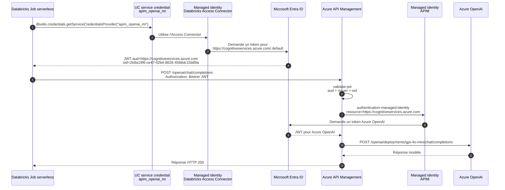

# POC Databricks -> APIM -> Azure OpenAI avec managed identity

Cette POC valide un appel Azure OpenAI via APIM, déclenché depuis un Job Databricks et authentifié sans secret applicatif.

Flux testé :

1. Un notebook Databricks utilise une Unity Catalog `SERVICE` credential adossée à un Databricks Access Connector.
2. Cette service credential émet un token Entra pour l'audience `https://cognitiveservices.azure.com`.
3. APIM valide le JWT entrant avec `validate-jwt`.
4. APIM autorise uniquement l'`oid` de la managed identity de l'Access Connector Databricks.
5. APIM appelle Azure OpenAI avec sa propre managed identity.

## Schéma du flux testé


```mermaid
sequenceDiagram
    autonumber
    participant Job as Databricks Job serverless
    participant Cred as UC service credential<br/>apim_openai_mi
    participant MI_DBX as Managed identity<br/>Databricks Access Connector
    participant Entra as Microsoft Entra ID
    participant APIM as Azure API Management
    participant MI_APIM as Managed identity<br/>APIM
    participant AOAI as Azure OpenAI

    Job->>Cred: dbutils.credentials.getServiceCredentialsProvider("apim_openai_mi")
    Cred->>MI_DBX: Utilise l'Access Connector
    MI_DBX->>Entra: Demande un token pour<br/>https://cognitiveservices.azure.com/.default
    Entra-->>Job: JWT aud=https://cognitiveservices.azure.com<br/>oid=2b9a19f6-ce47-42b4-8826-4568dc15b89a
    Job->>APIM: POST /openai/chat/completions<br/>Authorization: Bearer JWT
    APIM->>APIM: validate-jwt<br/>aud + issuer + oid
    APIM->>MI_APIM: authentication-managed-identity<br/>resource=https://cognitiveservices.azure.com
    MI_APIM->>Entra: Demande un token Azure OpenAI
    Entra-->>APIM: JWT pour Azure OpenAI
    APIM->>AOAI: POST /openai/deployments/gpt-4o-mini/chat/completions
    AOAI-->>APIM: Réponse modèle
    APIM-->>Job: Réponse HTTP 200
```

## Ressources déployées

- Resource group : `rg-dbxapimpoc-60ld4e`
- Databricks workspace : `dbxapimpoc-60ld4e-dbx`
- Databricks workspace URL : `adb-7405610989278804.4.azuredatabricks.net`
- Databricks Access Connector : `dbxapimpoc-60ld4e-ac`
- Managed identity de l'Access Connector : `2b9a19f6-ce47-42b4-8826-4568dc15b89a`
- Service credential Unity Catalog : `apim_openai_mi`
- Azure OpenAI account : `dbxapimpoc60ld4eaoai`
- Azure OpenAI endpoint : `https://dbxapimpocaoai60ld4e.openai.azure.com/`
- Azure OpenAI deployment : `gpt-4o-mini`, pointant vers le modèle `gpt-4.1-mini` version `2025-04-14`
- APIM : `dbxapimpoc60ld4eapim`
- APIM gateway : `https://dbxapimpoc60ld4eapim.azure-api.net`
- APIM endpoint : `https://dbxapimpoc60ld4eapim.azure-api.net/openai/chat/completions`
- Audience JWT acceptée par APIM : `https://cognitiveservices.azure.com`
- Issuer JWT accepté par APIM : `https://sts.windows.net/${tenant_id}/`
- Claim d'autorisation APIM : `oid == 2b9a19f6-ce47-42b4-8826-4568dc15b89a`
- Databricks Job : `poc-apim-openai-managed-identity-test`
- Notebook importé : `/Users/${databricks_user}/test_apim_managed_identity`

## Détail de l'implémentation

Terraform déploie l'infrastructure Azure :

- `azurerm_resource_group` pour isoler la POC.
- `azurerm_databricks_workspace` en SKU `premium`.
- `azurerm_databricks_access_connector` avec identité managée système.
- `azurerm_cognitive_account` de type `OpenAI`, avec `local_auth_enabled=false` pour éviter l'usage de clés.
- `azurerm_api_management` en SKU `Consumption_0`, avec identité managée système.
- `azurerm_role_assignment` donnant à l'identité managée APIM le rôle `Cognitive Services OpenAI User` sur le compte Azure OpenAI.
- `azurerm_api_management_api`, `azurerm_api_management_api_operation` et `azurerm_api_management_api_policy` pour exposer `/openai/chat/completions`.
- `azuread_application`, `azuread_service_principal` et `azuread_app_role_assignment` restent présents dans le code, mais le test final n'utilise pas l'audience `api://...` car elle n'est pas compatible avec le provider de service credential Databricks.

La policy APIM fait deux validations distinctes :

- Entrant Databricks vers APIM : `validate-jwt` vérifie l'audience, l'issuer et l'`oid` de la managed identity Databricks.
- Sortant APIM vers Azure OpenAI : `authentication-managed-identity` obtient un token pour `https://cognitiveservices.azure.com` avec l'identité managée d'APIM.

Le script `deploy-databricks-mi-pipeline.sh` déploie la partie Databricks non couverte par Terraform :

- Création idempotente de la Unity Catalog service credential `apim_openai_mi` avec `purpose=SERVICE`.
- Association de cette credential à l'Access Connector Terraform.
- Import d'un notebook Python de test.
- Création ou mise à jour d'un Job Databricks.
- Lancement du Job et récupération de la sortie du run.

## Serverless et egress réseau

Le test a été exécuté depuis un Job Databricks utilisant du compute serverless. Le workspace Azure Databricks lui-même reste un workspace Azure Databricks classique ; c'est le compute du Job qui est serverless.

Point important pour un contexte avec Conditional Access :

- Le token Entra est demandé depuis le runtime Databricks serverless via `dbutils.credentials.getServiceCredentialsProvider("apim_openai_mi")`.
- L'appel au token endpoint Entra ID ne sort pas depuis un VNet ou un NAT Gateway déployé dans ce projet.
- Le trafic réseau sortant du compute serverless passe par le compute plane managé Databricks/Microsoft.
- Ce n'est pas "natté dans le tenant" simplement parce que les ressources sont dans le même tenant Entra.
- Si des Conditional Access policies évaluent la localisation réseau, les IP vues par Entra ID peuvent donc être celles du plan serverless Databricks/Microsoft, pas une IP publique contrôlée par le tenant client.

La POC valide donc correctement l'usage de la managed identity depuis Databricks serverless, mais elle ne valide pas un scénario avec egress IP client fixe. Pour rendre le test encore plus proche d'un environnement avec restrictions réseau, il faut ajouter une configuration Databricks de contrôle d'egress serverless, par exemple une Network Connectivity Configuration / network policy si disponible dans l'environnement cible, ou utiliser du compute Databricks classique avec VNet injection et NAT Gateway.

## Fichiers

- [terraform/main.tf](/home/marc/poc-databricks-apim-openai/terraform/main.tf)
- [terraform/outputs.tf](/home/marc/poc-databricks-apim-openai/terraform/outputs.tf)
- [terraform/variables.tf](/home/marc/poc-databricks-apim-openai/terraform/variables.tf)
- [scripts/deploy-openai-model.sh](/home/marc/poc-databricks-apim-openai/scripts/deploy-openai-model.sh)
- [scripts/deploy-databricks-mi-pipeline.sh](/home/marc/poc-databricks-apim-openai/scripts/deploy-databricks-mi-pipeline.sh)

## How to démarrer la POC

Prérequis locaux :

- Azure CLI installé et authentifié avec `az login`.
- Terraform `>= 1.6`.
- `jq`, `curl` et `base64`.
- Droits Azure pour créer les ressources du projet : Resource Group, Databricks workspace, Databricks Access Connector, APIM, Azure OpenAI, role assignment.
- Droits Microsoft Entra pour créer une application/service principal, ou adaptation du code si cette partie est gérée par une équipe IAM.
- Droits Databricks workspace admin ou droits suffisants pour créer une Unity Catalog service credential `SERVICE`.

1. Cloner le dépôt.

```bash
git clone https://github.com/liesai/poc-databricks-apim-openai.git
cd poc-databricks-apim-openai
```

2. Vérifier le contexte Azure.

```bash
az account show -o table
```

Si le mauvais abonnement est actif :

```bash
az account set --subscription "<subscription_id>"
```

3. Créer le fichier de variables Terraform.

```bash
cd terraform
cp terraform.tfvars.example terraform.tfvars
```

Renseigner au minimum :

```hcl
subscription_id = "<subscription_id>"
tenant_id       = "<tenant_id>"
publisher_email = "<email>"
```

Optionnellement ajuster `location`, `openai_location`, `name_prefix` et les tags.

4. Déployer l'infrastructure.

```bash
terraform init
terraform validate
terraform plan -out=tfplan
terraform apply tfplan
```

5. Déployer ou vérifier le modèle Azure OpenAI.

```bash
cd ..
./scripts/deploy-openai-model.sh
```

Par défaut, le script crée un deployment nommé `gpt-4o-mini` avec le modèle `gpt-4.1-mini` version `2025-04-14`. Ce choix garde le nom logique attendu par la policy APIM tout en évitant la version dépréciée de `gpt-4o-mini`.

Pour changer le modèle :

```bash
MODEL_DEPLOYMENT_NAME="my-deployment" MODEL_NAME="gpt-4.1-mini" ./scripts/deploy-openai-model.sh
```

Si `MODEL_DEPLOYMENT_NAME` change, adapter aussi `openai_model_deployment_name` dans `terraform.tfvars` puis réappliquer Terraform.

6. Déployer et lancer le pipeline Databricks.

```bash
./scripts/deploy-databricks-mi-pipeline.sh
```

Le script crée ou met à jour :

- la service credential Unity Catalog `apim_openai_mi`
- le notebook `/Users/${databricks_user}/test_apim_managed_identity`
- le Job Databricks `poc-apim-openai-managed-identity-test`

Il lance ensuite le Job et attend le résultat.

7. Valider le résultat attendu.

La sortie attendue ressemble à ceci :

```json
{
  "status": 200,
  "service_credential": "apim_openai_mi",
  "apim_audience": "https://cognitiveservices.azure.com",
  "token_aud": "https://cognitiveservices.azure.com",
  "model_response": "mi-ok"
}
```

Les deux points clés à vérifier sont `status=200` et `model_response=mi-ok`. Le champ `token_oid` doit correspondre au principal ID de l'Access Connector exposé par `terraform output databricks_access_connector_principal_id`.

8. Nettoyer la POC.

```bash
cd terraform
terraform destroy
```

Si Azure renvoie une erreur transitoire sur APIM, par exemple `412 PreconditionFailed`, relancer simplement `terraform destroy`.

## Déploiement infra

```bash
cd /home/marc/poc-databricks-apim-openai/terraform
terraform init
terraform plan -out=tfplan
terraform apply tfplan
```

Ce déploiement a été exécuté avec succès : `14 added, 0 changed, 0 destroyed`.

Une mise à jour complémentaire de policy APIM a ensuite été appliquée : `0 added, 1 changed, 0 destroyed`.

## Déploiement du modèle

```bash
cd /home/marc/poc-databricks-apim-openai
./scripts/deploy-openai-model.sh
```

Le modèle initial `gpt-4o-mini` version `2024-07-18` est refusé par Azure car il est déprécié depuis le 31 mars 2026. Le script déploie donc par défaut le modèle de remplacement `gpt-4.1-mini` version `2025-04-14`, tout en conservant le nom de déploiement `gpt-4o-mini` attendu par la policy APIM.

## Pipeline Databricks

```bash
cd /home/marc/poc-databricks-apim-openai
./scripts/deploy-databricks-mi-pipeline.sh
```

Le script effectue ces actions :

- vérifie/crée le déploiement Azure OpenAI
- vérifie/crée la service credential Unity Catalog `apim_openai_mi`
- importe le notebook de test dans le workspace Databricks
- crée ou met à jour le Job Databricks
- lance le Job et attend le résultat
- affiche la sortie du notebook

## Résultat testé

Dernier run Databricks : `744930625624466`.

Résultat :

```json
{
  "status": 200,
  "service_credential": "apim_openai_mi",
  "apim_url": "https://dbxapimpoc60ld4eapim.azure-api.net/openai/chat/completions",
  "apim_audience": "https://cognitiveservices.azure.com",
  "token_aud": "https://cognitiveservices.azure.com",
  "token_oid": "2b9a19f6-ce47-42b4-8826-4568dc15b89a",
  "token_appid": "1fb6e061-bc18-43d1-a00d-0acf1e1c12c5",
  "model_response": "mi-ok"
}
```

Ce résultat confirme que le token est bien émis pour l'audience attendue, que l'`oid` correspond à la managed identity de l'Access Connector Databricks, qu'APIM accepte le token, et qu'Azure OpenAI répond via la managed identity APIM.

## Test Model Serving endpoint

Une variante a été ajoutée pour tester explicitement le scénario suivant :

```text
Client
  -> Databricks Model Serving endpoint
    -> code Python du modèle MLflow pyfunc
      -> Unity Catalog service credential / Access Connector managed identity
      -> APIM
      -> Azure OpenAI
```

Le script [scripts/deploy-databricks-serving-mi-test.sh](scripts/deploy-databricks-serving-mi-test.sh) automatise ce test :

- création ou mise à jour de la service credential Unity Catalog `apim_openai_mi`
- enregistrement d'un modèle MLflow `pyfunc` dans Unity Catalog
- création ou mise à jour d'un endpoint Databricks Model Serving
- invocation de l'endpoint avec un payload minimal
- tentative d'obtention d'un token Entra depuis le code `predict()` du modèle
- appel APIM uniquement si le token managed identity est obtenu

Le modèle de test ne contient pas de fallback par clé Azure OpenAI, bearer token statique, secret client, PAT ou autre mécanisme d'authentification. Si la managed identity n'est pas disponible depuis le runtime Model Serving, le test échoue volontairement.

Résultat observé :

```text
Databricks API POST /serving-endpoints/apim-mi-serving-probe/invocations failed with HTTP 400.
Encountered an unexpected error while evaluating the model.
```

Erreur retournée par le code du modèle :

```text
ModuleNotFoundError("No module named 'databricks.service_credentials'")
NameError("name 'dbutils' is not defined")
```

Interprétation :

- Le serving endpoint est bien créé.
- Le modèle MLflow `pyfunc` est bien chargé.
- L'exécution arrive bien dans la méthode `predict()`.
- L'appel APIM n'est jamais tenté, car le runtime Model Serving ne permet pas d'obtenir la Unity Catalog service credential.
- L'API notebook `dbutils.credentials.getServiceCredentialsProvider(...)` n'est pas disponible dans le runtime Model Serving.
- L'API `databricks.service_credentials.getServiceCredentialsProvider(...)`, documentée pour certains contextes UDF, n'est pas disponible dans ce runtime Model Serving.

Conclusion de la POC :

```text
Databricks Job/Notebook serverless -> UC service credential -> Access Connector MI -> APIM -> Azure OpenAI
```

est validé.

```text
Databricks Model Serving endpoint -> UC service credential -> Access Connector MI -> APIM -> Azure OpenAI
```

n'est pas validé avec le runtime Model Serving testé. Le blocage se situe dans le conteneur Model Serving, au moment où le code du modèle essaie d'obtenir une credential managed identity. Ce n'est pas un problème APIM ni Azure OpenAI : le test notebook confirme que la même service credential, le même Access Connector et la même policy APIM fonctionnent correctement hors Model Serving.

Les alternatives qui utilisent une clé API, un bearer token statique, un service principal avec secret client, ou un secret Databricks ne répondent pas à l'objectif de cette POC, qui est de valider un flux sans secret applicatif.

## Alternative Model Serving avec service principal

Pour un workload Databricks Model Serving, la managed identity via Unity Catalog service credential n'est pas disponible dans le runtime testé. Une alternative plus réaliste que les API keys consiste à utiliser OAuth client credentials avec un service principal Entra dédié au serving endpoint.

Le test complet de redirection `login.microsoftonline.com` depuis Model Serving via Databricks NCC, Private Link Service, Internal Load Balancer et HAProxy est détaillé dans [docs/databricks-serving-login-proxy-ncc.md](docs/databricks-serving-login-proxy-ncc.md).

Flux cible :

```text
Client
  -> Databricks Model Serving endpoint
    -> code Python du modèle MLflow pyfunc
      -> client credentials Entra
      -> token aud=api://... role=APIM.Proxy.Invoke
      -> APIM /openai/sp/chat/completions
      -> Azure OpenAI via managed identity APIM
```

Cette variante ne supprime pas tout secret côté Model Serving : le `client_secret` du service principal doit être stocké dans un Databricks secret scope et injecté dans le serving endpoint avec la syntaxe `{{secrets/scope/key}}`. Elle supprime en revanche l'usage d'API key Azure OpenAI côté client Databricks, centralise l'autorisation sur Entra/APIM, et garde l'accès Azure OpenAI sans clé grâce à la managed identity d'APIM.

Terraform ajoute :

- une application Entra `serving-client`
- un service principal associé
- une app role assignment `APIM.Proxy.Invoke` vers l'application protégée APIM
- une opération APIM séparée `POST /openai/sp/chat/completions`
- une policy APIM dédiée validant le JWT Entra du service principal

Le script [scripts/deploy-databricks-serving-sp-test.sh](scripts/deploy-databricks-serving-sp-test.sh) automatise le test :

- crée ou réutilise un secret applicatif pour le service principal `serving-client`
- stocke ce secret dans un Databricks secret scope
- enregistre un modèle MLflow `pyfunc`
- déploie un Databricks Model Serving endpoint
- obtient un token Entra depuis `predict()` avec le flow `client_credentials`
- appelle APIM avec ce bearer token
- vérifie que la réponse Azure OpenAI revient via APIM

Exécution :

```bash
cd /home/marc/poc-databricks-apim-openai
./scripts/deploy-databricks-serving-sp-test.sh
```

Par défaut, le script crée un nouveau secret applicatif Entra d'une durée d'un an avec `az ad app credential reset`, puis le pousse dans Databricks secrets. Pour fournir un secret déjà géré par l'équipe IAM :

```bash
SERVING_CLIENT_SECRET="<client_secret>" ./scripts/deploy-databricks-serving-sp-test.sh
```

Résultat attendu :

```json
{
  "predictions": [
    {
      "status": 200,
      "auth_flow": "service_principal_client_credentials",
      "apim_audience": "api://...",
      "token_roles": ["APIM.Proxy.Invoke"],
      "model_response": "sp-ok"
    }
  ]
}
```

Ce test prouve un flux sans API key Azure OpenAI depuis Databricks Model Serving. Il ne prouve pas un flux managed identity pur depuis Model Serving.

### Redirection de `login.microsoftonline.com` via Private Link Service

Pour tester l'origine réseau du flux OAuth client credentials, la POC peut être complétée avec le schéma suivant :

```text
Databricks Model Serving
  -> DNS/NCC domain rule pour login.microsoftonline.com
  -> Databricks-managed private endpoint
  -> Azure Private Link Service
  -> Internal Load Balancer
  -> HAProxy TCP passthrough
  -> NAT / egress IP corporate
  -> login.microsoftonline.com
```

Le script [scripts/configure-databricks-login-proxy-ncc.sh](scripts/configure-databricks-login-proxy-ncc.sh) configure la partie Databricks NCC :

- crée ou réutilise une Network Connectivity Configuration
- crée ou réutilise une private endpoint rule vers le Private Link Service du proxy HAProxy
- associe le domain name `login.microsoftonline.com` à cette règle
- attache la NCC au workspace Databricks de la POC

Prérequis :

- le Private Link Service HAProxy existe déjà
- le HAProxy fait du TCP passthrough TLS, sans terminaison TLS
- le backend HAProxy sort vers `login.microsoftonline.com:443`
- l'egress du HAProxy est natté avec les IP corporate attendues par Conditional Access
- l'utilisateur Azure/Databricks courant peut administrer les NCC au niveau account Databricks

Exécution :

```bash
export DATABRICKS_ACCOUNT_ID="<account_id_databricks>"
export LOGIN_PROXY_PRIVATE_LINK_SERVICE_ID="/subscriptions/<sub>/resourceGroups/<rg>/providers/Microsoft.Network/privateLinkServices/<pls>"

./scripts/configure-databricks-login-proxy-ncc.sh
```

Après création de la règle, approuver la private endpoint connection côté Private Link Service, puis attendre l'état `ESTABLISHED` dans la NCC Databricks. Ensuite relancer le test service principal :

```bash
./scripts/deploy-databricks-serving-sp-test.sh
```

Critères de succès attendus :

- la réponse Model Serving contient `model_response = sp-ok`
- les logs HAProxy montrent un flux TLS vers `login.microsoftonline.com:443`
- les sign-in logs Entra du service principal montrent l'IP source corporate/NAT attendue

## Point technique important

La première variante utilisait une audience applicative `api://...` avec un app role `APIM.Proxy.Invoke`. Le provider Databricks `dbutils.credentials.getServiceCredentialsProvider(...)` n'accepte pas cette audience comme URI de ressource pour l'émission du token. La policy APIM a donc été adaptée pour valider une audience Azure valide, `https://cognitiveservices.azure.com`, puis restreindre l'accès par claim `oid`.

## Destruction

```bash
cd /home/marc/poc-databricks-apim-openai/terraform
terraform destroy
```
